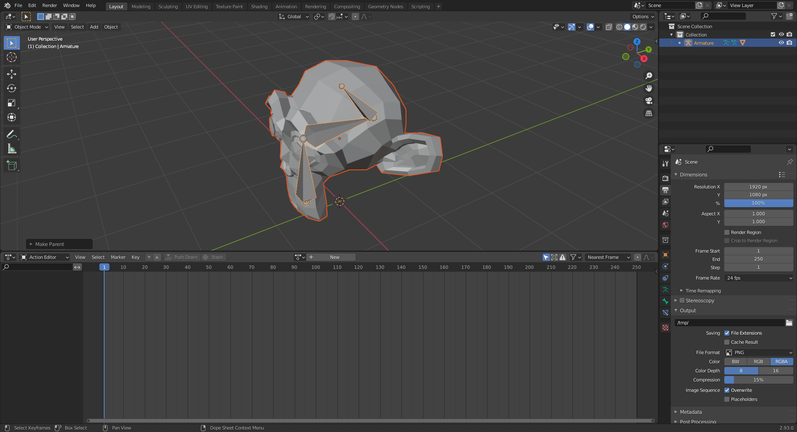

# Indie-Studio

[](https://gitlab.com/epitech-it-2025/curs3w4ll/Indie-Studio/-/settings/repository)

## main

[](https://gitlab.com/epitech-it-2025/curs3w4ll/Indie-Studio/-/pipelines/latest)

[](https://gitlab.com/epitech-it-2025/curs3w4ll/Indie-Studio/-/pipelines/latest)
[](https://gitlab.com/epitech-it-2025/curs3w4ll/Indie-Studio/-/pipelines/latest)
[](https://gitlab.com/epitech-it-2025/curs3w4ll/Indie-Studio)
[](https://gitlab.com/epitech-it-2025/curs3w4ll/Indie-Studio)

## dev

[](https://gitlab.com/epitech-it-2025/curs3w4ll/Indie-Studio/-/pipelines/latest)

[](https://gitlab.com/epitech-it-2025/curs3w4ll/Indie-Studio/-/pipelines/latest)
[](https://gitlab.com/epitech-it-2025/curs3w4ll/Indie-Studio/-/pipelines/latest)
[](https://gitlab.com/epitech-it-2025/curs3w4ll/Indie-Studio)
[](https://gitlab.com/epitech-it-2025/curs3w4ll/Indie-Studio)

---

## Contributors

[Corentin HERVAUD](https://github.com/Curs3W4ll)  
[Nicolas MOINARD](https://github.com/Rekwass)  
[Denis ROUX](https://github.com/DenisRx)  
[Nathan LEMALE](https://github.com/Naleeee)  
[Baptiste MOUNIER-VANDERHAEGEN-GILLOT](https://github.com/Baptiste-MV)  
[Benjamin MOUGINET](https://github.com/benalex33000)  

---

<details>
<summary>How to create animated 3D objects</summary>

# How to create animated 3D objects with blender

## Installation

First of the first, you need to install blender 2.93

```
wget https://ftp.nluug.nl/pub/graphics/blender/release/Blender2.93/blender-2.93.0-linux-x64.tar.xz
```
```
tar -xvf blender-2.93.0-linux-x64.tar.xz
```
```
cd blender-2.93.0*release
```
```
./blender
```

In blender, add a new add-on

Go in *Edit/Preferences* -> *Add-ons*, then click *Install...*


Select the python script for blender 2.93 from [here](https://github.com/lsalzman/iqm)

Search `iqm` and activate the add-on


## Modelisation

First of all, you need to have a 3D object (mesh)


Then, create the armature you want, edit it in *Edit mode*


Link the armature to the mesh
- In *object mode*
- LeftClick on the mesh
- Shift+LeftClick on the armature
- Ctrl+p
- Select *Armature Deform/With Automatic Weights*

Make animations in 60 fps


Pass in *Dope Sheet* mode


And then in *Action Editor*


Click *new*


Create as many animation as you want by cloning the first  
Once you have created all your animations, clone the last created one, this new animation will be the one unused  
Delete this animation


And add *Fake User* on all the others


You should have something like this, the **0** one is the deleted and all others should be **F**


For each animation, position at first frame



In *Pose mode*, select all bones by pressing *A*  
Then press *I* and select *Location & Rotation*


At each frame you want a different position, move your bones, and then repeat the previous actions

Now you have your animations, you can save the models with the animations has an *.iqm* file  

Select the model and the armature:
- LeftClick on the mesh
- Shift+LeftClick on the armature

Click on *File/Export/Inter-Quake Model*


When exporting, give your model a name, and **DON'T FORGET TO SPECIFY THE ANIMATIONS**  
Animations specify are just the names of the animations comma-seperated


All done !

</details>

<details>
<summary>ECS</summary>

# How to use ECS

## How does the ECS work ?

First, you could read [this article](https://austinmorlan.com/posts/entity_component_system) we based our ECS on

The ECS is constitued of 4 main parts:
- The entities
- The components
- The systems
- The events

But what are these parts ?

### The entities

An entity is a just an ID that represent something, this could be a player, a wall, a text, anything

In reality this entity of type `ecs::Entity` is just a unique number that represent something  
This `ecs::Entity` is used to identify each entity in every part of the ECS

### The components

A component is a mass of data that caracterise an entity  
This data could be any type, a structure, a class...

Each entity has its own components, with a data associated to this specific entity  
Components should just be caracteristics of the entities  
For example, a position is a component, a full example is given at the end of the explanation

### The systems

A system is an object that make modification on the components of the entities  
Each system modify each entity that have been registered in

Each entity has it own "component signature"  
This signature is a bitset (`0010101101`) when each bit represents a component and each bit set to `1` mean that the entity has and use the component registered at this bit  
You don't have to manipulate this bitset, the ECS does it for you

All you have to remember is that you need to indicate to the ECS that you want your entities to be able to have a certain component  
For that you need to use the function `registerComponent` from the ECS  
This function will bind a slot of the bitset to your component

Now that you know what is a signature (do not hesitate to read what is a signature again), I can easily describe you how the ECS work  
In this example we will assume that the component `Position` is just an `int x` and an `int y` and the component `Movement` is also an `int x` and an `int y`  
First, you have to register the component `Position` in the ECS, now the bit at position 0 (furthest to the right position) is bind to the `Position` component  
Same for the component `Movement`, now the bit at position 1 (furthest to the right - 1 position) is bind to the `Movement` component  
Then you can create three entities, `A`, `B` and `C`  
You can assign the component `Position` to entity `A`, its signature will be `10`  
You can assign the component `Position` and `Movement` to entity `B`, its signature will be `11`  
We will not assign any component to entity `C`  

So now, the systems  
A system will act on every entity that contain the system signature  
For example a system with the signature `00110`  
will apply on an entity with the signature `00110`  
will also apply on an entity with the signature `10110`  
but will not apply on an entity with the signature `10100`  
Because the bits at position 2 and 3 are set to 1 in the two first entities

Taking the previous example, we will create a system `MovementSystem` with the mission to add the `x` and the `y` contained in the `Movement` component to the `x` and the `y` contained in the `Position` component

For that we first have to, like the components, register the system in the ECS  
A system is a class inheriting from the `System` class  
Then we have to set the signature of the system, this will define which component the system will operate on

Assume that entity `A` has the following components:
```cpp
Position {
    int x = 10; 
    int y = 30; 
};

Movement {
    int x = 2;
    int y = 5;
};
```
When we apply (or update) the `MovementSystem` on the entity `A`, we will then have
```cpp
Position {
    int x = 12; 
    int y = 35; 
};

Movement {
    int x = 2;
    int y = 5;
};
```

And that's it !  
This is how to ECS works  
This example was a simple system and simple components, but you can make much more complex ones

### The events

Events are a bit appart from the entities, components and systems

Events describe an action  
With the ECS, we can specify what we want to do when a specific event occurs  
For example `INPUT` when a new input is entered in the window is an event

Each event have associated listeners, which are just function calls  
These listeners are traditionally set at the start of the program  
You can set that the function `treatInput` with the arguments `int x` and `int y` has to be called when the `INPUT` event occurs

For that you first have to register the listener  
Then you can trigger all associated listeners (in our case just one) associated to a specific event by sending it to the ECS

---

For more simplicity, all the managers that control the entities, components, systems and events have been regrouped in a global object, the coordinator

Here is it definition:
```cpp
class Coordinator {
   public:
    Coordinator() noexcept = default;
    Coordinator(Coordinator const& other) noexcept = delete;
    Coordinator(Coordinator&& other) noexcept = default;
    ~Coordinator() noexcept = default;

    Coordinator& operator=(Coordinator const& other) noexcept = delete;
    Coordinator& operator=(Coordinator&& other) noexcept = default;

    /*
     * Create a new entity
     *
     * Return the newly created entity
     */
    Entity createEntity();
    /*
     * Destroy an existing entity
     *
     * No return value
     *
     * entity -> The entity to destroy
     */
    void destroyEntity(Entity entity);

    /*
     * Register a new component to the manager
     *
     * No return value
     */
    template <typename T>
    void registerComponent() {
        this->componentsManager.registerComponent<T>();
    }
    /*
     * Get the specified component type
     *
     * Return the type of the component
     */
    template <typename T>
    ComponentType getComponentType() const {
        return this->componentsManager.getComponentType<T>();
    }
    /*
     * Set a component for an entity
     *
     * No return value
     *
     * entity -> The entity to set component for
     *
     * component -> The component to set
     */
    template <typename T>
    void setComponent(Entity entity, T component) {
        this->componentsManager.setComponent<T>(entity, component);

        auto signature = this->entitiesManager.getSignature(entity);
        signature.set(this->componentsManager.getComponentType<T>(), true);
        this->entitiesManager.setSignature(entity, signature);

        this->systemsManager.entitySignatureChanged(entity, signature);
    }
    /*
     * Remove a component for an entity
     *
     * No return value
     *
     * entity -> The entity to remove component for
     *
     * component -> The component to remove
     */
    template <typename T>
    void removeComponent(Entity entity) {
        auto signature = this->entitiesManager.getSignature(entity);
        signature.set(this->componentsManager.getComponentType<T>(), false);
        this->entitiesManager.setSignature(entity, signature);

        this->systemsManager.entitySignatureChanged(entity, signature);
    }
    /*
     * Get the component associated to the given entity
     *
     * Return a reference to the component
     *
     * entity -> The entity to get the associated component
     */
    template <typename T>
    T& getComponent(Entity entity) noexcept {
        return this->componentsManager.getComponent<T>(entity);
    }

    /*
     * Register a new system in the manager
     *
     * Return a reference to the newly created system
     */
    template <typename T>
    T& registerSystem() {
        return this->systemsManager.registerSystem<T>();
    }
    /*
     * Set a new components signature for a system
     *
     * No return value
     *
     * signature -> The new signature to set
     */
    template <typename T>
    void setSystemSignature(ComponentSignature signature) {
        this->systemsManager.setSystemSignature<T>(signature);
    }

    /*
     * Call all listeners functions associated to the given event
     *
     * No return value
     *
     * event -> The event to call associated listeners
     */
    void sendEvent(const Events& event) noexcept;
    /*
     * Call all listeners functions associated to the given events
     *
     * No return value
     *
     * events -> The events to call associated listeners
     */
    void sendEvents(const std::vector<Events>& events) noexcept;
    /*
     * Add a listener function to call when the given event occured
     *
     * No return value
     *
     * event -> The event the listener will be associated with
     *
     * f -> The function to call
     *
     * args -> The arguments to pass to the function
     */
    template <typename F, typename... Args>
    void addEventListener(const Events& event, F&& f, Args&&... args) noexcept {
        this->eventsManager.addListener(event, std::forward<F>(f),
                                        std::forward<Args>(args)...);
    }
    /*
     * Add a listener function to call when the given event occured
     *
     * No return value
     *
     * events -> The events the listener will be associated with
     *
     * f -> The function to call
     *
     * args -> The arguments to pass to the function
     */
    template <typename F, typename... Args>
    void addEventListener(const std::vector<Events>& events, F&& f,
                          Args&&... args) noexcept {
        for (const auto& event : events) {
            this->addEventListener(event, std::forward<F>(f),
                                   std::forward<Args>(args)...);
        }
    }

   private:
    EntitiesManager entitiesManager;
    ComponentsManager componentsManager;
    SystemsManager systemsManager;
    EventsManager eventsManager;
};
```

According to the previous examples, we need to use:

To create a new entity, `Entity createEntity()` that return the identifier for this new entity  
To destroy an entity, `void destroyEntity(Entity entity)`

To register a component, `void registerComponent<T>()`  
To get the signature (associated bitset) of a component, `ComponentType getComponentType<T>()`  
To assign a component to an entity, `void setComponent<T>(Entity entity, T component)`  
To unassign a component from an entity, `void removeComponent<T>(Entity entity)`  
To get a reference to the component associated to a specific entity so you can modify it, `T& getComponent<T>(Entity entity)`

To register a new system, `T& registerSystem<T>()`, this function return a reference to the system to let you decide when to update it  
To set the signature of a system, `void setSystemSignature<T>(ComponentSignature signature)`

To add a new listener to an event, `void addEventListener(Events event, F f, Args... args)`, note that f is a function and args is a variadic list of arguments passed to the function  
Hint: you probably want to pass references  
To add a new listener to multiple events, `void addEventListener(vector<Events> events, F f, Args... args)`
To send a unique event and trigger the listeners associated to this event, `void sendEvent(Events event)`  
To send multiple events, `void sendEvents(vector<Events> events)`, note that the event will not always be treated in the same order you specified them

Here is an example of a use of the ECS:

<details>

<summary>Examples</summary>

### ECS simple example

```cpp
struct Position {
    int x;
    int y;
};

struct Movement {
    int x;
    int y;
};

// Defined by the ECS core
class System {
   public:
    void addEntity(ecs::Entity entity) noexcept {
        this->entities.insert(entity);
    }
    void removeEntity(ecs::Entity entity) noexcept {
        this->entities.erase(entity);
    }

   protected:
    std::set<ecs::Entity> entities;
};

class MovementSystem final : public System {
   public:
    void update(ecs::Coordinator& coordinator) {
        for (const auto& entity : this->entities) {
            auto& position = coordinator.getComponent<Position>(entity);
            auto& movement = coordinator.getComponent<Movement>(entity);

            position.x += movement.x;
            position.y += movement.y;
        }
    }
};

int main() {
    ecs::Coordinator coordinator;

    coordinator.registerComponent<Position>();
    coordinator.registerComponent<Movement>();

    auto& movementSystem = coordinator.registerSystem<MovementSystem>();
    {
        ecs::ComponentSignature signature;
        signature.set(coordinator.getComponentType<Position>());
        signature.set(coordinator.getComponentType<Movement>());
        coordinator.setSystemSignature<MovementSystem>(signature);
    }
    ecs::Entity entity = coordinator.createEntity();

    coordinator.setComponent<Position>(entity, {10, 30});
    coordinator.setComponent<Movement>(entity, {2, 5});

    // entity position: x: 10, y: 30
    movementSystem.update(coordinator);
    // entity position: x: 12, y: 35

    return 0;
}
```

### ECS events example

```cpp
void listener1() { std::cout << "Listener 1 called" << std::endl; }

void listener2() { std::cout << "Listener 2 called" << std::endl; }

void listener1arg(int x) {
    std::cout << "Listener with arg " << x << " called" << std::endl;
}

void listener1refarg(int& x) {
    std::cout << "Listener with arg " << x << " called" << std::endl;
}

enum class Events {
    EVENT1,
    EVENT2,
    EVENT3,
}

int main() {
    ecs::Coordinator coordinator;

    coordinator.addEventListener(Events::EVENT1, listener1);
    coordinator.addEventListener({Events::EVENT2, Events::EVENT3}, listener2);
    coordinator.addEventListener(Events::EVENT1, listener1arg, 4);
    int x = 2;
    coordinator.addEventListener(Events::EVENT3, listener1refarg, x);

    coordinator.sendEvents({Events::EVENT1, Events::EVENT2});
    // out:
    // ==========
    // Listener 1 called
    // Listener with arg 4 called
    // Listener 2 called
    // ==========
    coordinator.sendEvent(Events::EVENT3);
    // out:
    // ==========
    // Listener with arg 2 called
    // ==========
    x = 5;
    coordinator.sendEvent(Events::EVENT3);
    // out:
    // ==========
    // Listener with arg 5 called
    // ==========

    return 0;
}
```

</details>

</details>

<details>

<summary>Naming convention</summary>

# Branch naming convention

Branches names should look like this:

`<issue-number>_<parent-branch>_<issue-summary>`

## Convention

### `issue-number`

The ID of the issue the branch is created for work on

### `parent-branch`

The name of the branch this branch will be merged to (and often is created from)

It is often the 'category' of the work

### `issue-summary`

The summary of the issue the branch is created for

## Examples

### Branch to do #13 issue and is from `Arduino` branch to create a clock

`13_Arduino_Create-clock`

### Branch to do #7 issue and is from `UI` branch to create auth page

`7_UI_Create-auth-page`

# Commit convention

Commits should look like this:

`<type>([scope]): <description> [#<issue-number>]`

`[body]`

## Convention

### `type`

The type if the classification of the modification you are commiting

For example, if you are adding a new functionality it will be `feat`

If you are solving a bug it will be `fix`

Here is a list of `type` keyword

- `feat`: adding of a new functionality / new library
- `fix`: Resolving a problem (bug, wrong display)
- `doc`: Adding new documentation
- `refact`: Refacting a part of code / all the code
- `test`: Adding tests
- `improvement`: Upgrading an existing functionality

### `scope`

The scope is optionnal, it's an indication of the part of code / functionality your commiting into

For exemple, if you're adding a ci you can use: `feat(ci)`

### `description`

The description is a brief text that describe what you are committing

### `issue-number`

The issue number allows linking your commit to an issue

It is also on what part of the code you're working

### `body`

The body is an optionnal additionnal information to add supports (links, images, ...)

Or just describe in details the problem you are fixing / you find

## Examples

### Commiting a new language on an application

`feat(language): Adding of the russian language #14`

`Adding the russian option for the translation of the home page`

### Commiting a bugfix

`fix(keyboard): Removing the blinking effect when pressing keys #54`

### Commiting new tests

`test(authentication): Adding full test on the authentication`

</details>
